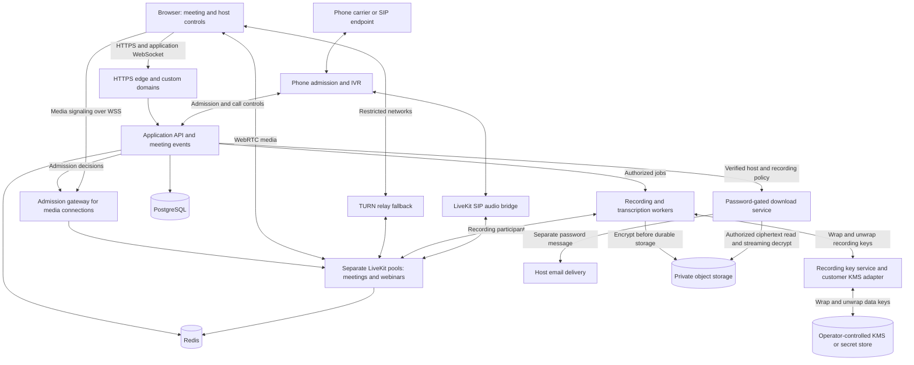

**Meeting platform infrastructure plan — October 4, 2026**

Build an open-source browser application over self-hosted LiveKit, with a separate application service that owns admission, permissions, meeting state, branding, and stored data. Sell a managed hosted edition using that same core. Include phone and audio SIP dial-in to meetings. Operate the infrastructure in accounts controlled by the project owner. Use portable containers, PostgreSQL, Redis, and S3-compatible storage so changing hosting providers remains possible.

This is a proposed design, not a deployed, audited or benchmarked system. The confirmed requirements are browser-only participation without attendee accounts, links or codes with passwords, white labeling, extensive meeting controls, 100-person meetings, 1,000-person webinars, phone/SIP dial-in, encrypted optional recording, customer-controlled keys for self-hosting, an intended open-source release and a paid hosted edition. The starting infrastructure budget is $300–$1,000/month; independent audits, compliance staff and FedRAMP authorization work are outside it. Server sizing, event volume and delivery estimates below are planning assumptions. The number of simultaneous large webinars is still open; plan for one initially.

**Support two modes from the first production release: 100-person meetings and 1,000-viewer webinars.** For capacity planning, reserve a little extra room for up to ten webinar presenters and operators. Within the starting budget, the provisional platform-wide launch envelope is one scheduled full-size webinar alongside up to 100 meeting participants across one large meeting or several smaller rooms. Additional simultaneous meetings or webinars require additional reserved capacity. Begin with one region near the main audience. Test a defined camera-heavy meeting workload before enabling the full limit. Display approximately 9–16 video tiles on desktop and fewer on mobile; published cameras, displayed tiles, connected participants, phone calls, and simultaneous recordings have separate limits.

| Mode    | Participation                                                                 | Media behavior                                                                                                 |
| ------- | ----------------------------------------------------------------------------- | -------------------------------------------------------------------------------------------------------------- |
| Meeting | Up to 100 participants with permission-based audio, camera and screen sharing | Interactive WebRTC, quality adaptation and limited visible video tiles                                         |
| Webinar | Up to 1,000 viewers plus a proposed limit of ten presenters/operators         | WebRTC audience with publishing disabled; subscribe to the presentation and a bounded selection of stage video |

Use WebRTC for the initial webinar so hand raising, questions and promotion to speaker remain responsive. Viewers can use application chat, polls and Q&A without publishing audio/video. Hosts approve promotion and enforce the stage limit. Presenter preflight, a separate backstage room, start/end broadcast controls and a reconnect holding screen are part of webinar scope. A private backstage conversation is never carried on an audience-visible track. Keep audience identity data in the authorized application roster and use opaque media identifiers.

Give meetings and webinars independent LiveKit deployments with separate coordination state and capacity budgets. Select the deployment on the backend when creating a meeting session. A large webinar cannot take over meeting nodes. For webinars, target roughly 2–4 Mbps received per viewer, including the selected stage media; actual layouts and screen content determine the measured number. An optional later HLS/CDN broadcast path can support much larger passive audiences, but adds encoder/distribution work and more delay. It is not required for the initial 1,000-viewer target.

LiveKit publishes single-node load-testing guidance and example large-room results, but those results do not certify this hardware or a ten-presenter webinar. Benchmark the exact layout, codec, subscription pattern and network conditions. [Benchmarking guidance](https://docs.livekit.io/transport/self-hosting/benchmark/)

**The architecture separates meeting decisions from media transport.** The application decides who may enter, speak, share, record, and moderate. LiveKit routes audio and video. Recording and transcription run in separate workers so their load cannot consume the resources reserved for live calls.

The diagram's admission gateway is a proposed custom component whose compatibility and enforcement must be proved in the first engineering milestone. Video does not pass through the application API or a normal website CDN. The browser-to-SFU hop is encrypted transport; the SFU can process standard-mode media. The carrier/PSTN side of phone ingress is outside that WebRTC protection, and only the SIP legs under our control can require TLS and SRTP.

| Component           | Proposed choice                                                                       | Responsibility                                                                                        |
| ------------------- | ------------------------------------------------------------------------------------- | ----------------------------------------------------------------------------------------------------- |
| Browser application | React, TypeScript, LiveKit browser SDK                                                | Custom meeting layout, prejoin checks, accessibility, device selection, host controls                 |
| Application backend | Node.js/TypeScript with Fastify; one modular application initially                    | Admission, roles, tenants, meeting state, administration, API and authenticated WebSocket events      |
| Media service       | Self-hosted LiveKit, independent meeting and webinar pools                            | Audio/video forwarding, quality adaptation, publish permissions and workload isolation                |
| Connection fallback | LiveKit's authenticated embedded TURN initially                                       | Relay media when a direct connection is blocked                                                       |
| Phone admission     | Asterisk with application-controlled IVR and call routing                             | Collect separate numeric phone locator/PIN, hold callers pending approval, apply phone controls       |
| Telephone media     | Self-hosted LiveKit SIP service and a replaceable carrier trunk                       | Connect authorized audio calls to meeting participants                                                |
| Durable database    | PostgreSQL                                                                            | Meeting definitions, sessions, invitations, policies, chat when enabled, recordings and audit records |
| Live coordination   | Redis, isolated from unrelated application workloads                                  | LiveKit cluster coordination and short-lived state                                                    |
| Background jobs     | PostgreSQL-backed jobs and transactional outbox                                       | Recording requests, exports, retention, webhooks and retries                                          |
| Recording security  | Encryption worker, key adapter and password-gated download service                    | Encrypt recordings before durable storage; protect keys; enforce 24-hour links                        |
| File storage        | Private S3-compatible buckets                                                         | Encrypted recordings, exports, brand assets and permitted uploads                                     |
| Observability       | OpenTelemetry, Prometheus-compatible metrics, Grafana and application error reporting | Call quality, failures, resource usage and cost                                                       |
| Deployment          | Containers on VMs, OpenTofu infrastructure definitions, GitHub Actions                | Reproducible provisioning, releases and rollback                                                      |

**The open-source core must run independently of the hosted business.** Ship the meeting UI, host controls, application API, database migrations, media configuration, phone integration, administration, documented extension points, Docker Compose setup and production deployment examples. A self-hosted installation supplies its own domain, storage and optional phone carrier. It must not require an account on our hosted service, license-server availability or mandatory telemetry to run meetings.

The hosted layer adds customer accounts, subscriptions, usage accounting, automatic provisioning, managed domains, backups, upgrades and support. Meeting guests still need no account; the paying customer signs in to manage billing and administration. Run the same versioned core in both editions, with an optional billing adapter rather than a long-lived product fork. Keep plan limits in server-side entitlements, separate from core roles. Store immutable usage events for participant-minutes, media transfer, recording/transcription, retained storage and phone minutes; reconcile them before billing. Payment webhooks must be verified and processed idempotently.

My default licensing recommendation is Apache-2.0 for the core to simplify adoption and commercial integration. It permits competitors to offer their own hosted versions, so the commercial value would come from service quality and operations. Decide the license before accepting external contributions or publishing the repository. Preserve each dependency's own license and notices; the core's license does not relabel separately distributed services. [Apache-2.0 terms](https://www.apache.org/licenses/LICENSE-2.0)

Self-hosted LiveKit offers control over deployment and configuration, and its server uses Apache 2.0. Preserve required notices and check licenses of additional codecs and enhancement libraries individually. [Self-hosting overview](https://docs.livekit.io/transport/self-hosting/), [server license](https://github.com/livekit/livekit/blob/master/LICENSE)

LiveKit is the recommended starting point because its existing SDKs and server APIs reduce the transport work. Mediasoup is a fallback if the first milestone exposes a non-negotiable permission or routing requirement LiveKit cannot meet. Mediasoup offers lower-level control but leaves signaling and more session behavior to the application. Changing media engines would still be a substantial project; a small application adapter does not make them interchangeable. [Mediasoup design](https://mediasoup.org/documentation/overview/)

**Publish an applicable-protocol conformance matrix, not a claim to follow every IETF standard.** WebRTC spans multiple RFCs and browser implementations; “all IETF standards” is not a meaningful test target. The release gate is interoperability and packet-level verification against the applicable standards below, including current errata and supported browser profiles. Never permit a plaintext fallback to make a call connect.

| Boundary                              | Required protocol behavior and verification                                                                                                                                                                                                                                                                                                                                                                                                                                                                                                                                                                                                                                                                                                                                                                                                                                                                                                                                                                                                                                                                                                       |
| ------------------------------------- | ------------------------------------------------------------------------------------------------------------------------------------------------------------------------------------------------------------------------------------------------------------------------------------------------------------------------------------------------------------------------------------------------------------------------------------------------------------------------------------------------------------------------------------------------------------------------------------------------------------------------------------------------------------------------------------------------------------------------------------------------------------------------------------------------------------------------------------------------------------------------------------------------------------------------------------------------------------------------------------------------------------------------------------------------------------------------------------------------------------------------------------------------- |
| Browser signaling and application API | HTTPS/WSS with modern TLS, secure cookies, origin and CSRF controls, certificate renewal tests, and no secrets in page-navigation URLs or logs. LiveKit's browser signaling protocol accepts an access token in the WebSocket handshake query, so issue narrowly scoped, short-lived media tokens and redact the entire handshake query at the edge, gateway, tracing and error-reporting layers; test that a URL never reaches logs or analytics. A one-use host bootstrap link uses a URL fragment, is exchanged and cleared immediately, and has a no-referrer policy and no third-party scripts. TLS 1.3 is preferred for web endpoints; maintain only tested TLS 1.2 fallback where client support requires it. [TLS 1.3, RFC 8446](https://www.rfc-editor.org/rfc/rfc8446), [LiveKit signaling protocol](https://docs.livekit.io/reference/internals/client-protocol/)                                                                                                                                                                                                                                                                      |
| Browser ↔ SFU media                  | Use the browser `RTCPeerConnection` API and current JSEP signaling, protect DTLS fingerprints in HTTPS/WSS signaling, use ICE with authenticated STUN/TURN for connectivity, and issue short-lived TURN credentials only to eligible sessions. Negotiate DTLS-SRTP for every media channel; use SRTP and SRTCP for all RTP/RTCP media and encrypted SCTP-over-DTLS data channels. Reject plain RTP, SDES keying and null encryption. Follow the mandatory interoperable profiles in the WebRTC security architecture, and use DTLS 1.3 only when the browser/SFU combination actually supports it. Test renegotiation, downgrade rejection, packet captures, certificates and browser interoperability. [WebRTC security, RFC 8827](https://www.rfc-editor.org/rfc/rfc8827), [JSEP, RFC 9429](https://www.rfc-editor.org/info/rfc9429/), [ICE, RFC 8445](https://www.rfc-editor.org/rfc/rfc8445), [TURN, RFC 8656](https://www.rfc-editor.org/rfc/rfc8656), [DTLS-SRTP, RFC 5764](https://www.rfc-editor.org/rfc/rfc5764), [SRTP, RFC 3711](https://www.rfc-editor.org/rfc/rfc3711), [DTLS 1.3, RFC 9147](https://www.rfc-editor.org/rfc/rfc9147) |
| SIP/phone ingress                     | Authenticate the trunk and require SIP-over-TLS plus SRTP on every SIP leg under our control; reject an unencrypted trunk instead of silently downgrading. Check actual carrier and bridge negotiation, not only configuration flags. The ordinary PSTN leg outside our SIP boundary cannot be called end-to-end encrypted. [Secure trunking](https://docs.livekit.io/telephony/features/secure-trunking/), [SIP, RFC 3261](https://www.rfc-editor.org/rfc/rfc3261)                                                                                                                                                                                                                                                                                                                                                                                                                                                                                                                                                                                                                                                                               |

DTLS-SRTP encrypts each browser-to-SFU hop, but the SFU is a media-processing trust boundary. It is not end-to-end encryption against the service operator. Private mode below adds application-level E2EE with its own key distribution. Media metadata, signaling, participant identities and traffic patterns remain visible to the service as required for routing and moderation. [WebRTC security architecture](https://www.rfc-editor.org/rfc/rfc8827), [LiveKit encryption model](https://docs.livekit.io/transport/encryption/)

**No-login access uses separate guest and host capabilities.** A meeting code identifies a meeting; it is not sufficient authorization. A display name is a label, not a verified identity. The hosted service generates each meeting code from a cryptographically secure random generator as 26 uniformly sampled Crockford Base32 characters (130 bits of entropy), formatted in groups for entry. Hosted APIs reject all requested custom codes, including administrator and vanity-code paths; no tenant can lower code length or randomness. Self-hosted operators may enable custom codes on their own installation. Custom codes are treated as public identifiers and must still pass the same password, invitation, lobby and rate-limit checks. Do not expose codes in public indexes, referrer headers, analytics, routine logs or meeting titles. Rotate or retire a compromised code and use a new physical room for each meeting occurrence.

1. An organizer creates a meeting through an authorized creation link or the administration interface. Public anonymous creation can be enabled later with creation quotas and abuse controls. A host who enables recording must first verify an email address through a one-time code; this verifies delivery without creating an attendee account.
2. The backend returns a guest link/code and a separate high-entropy, one-use host bootstrap capability. Its URL fragment is exchanged for a first-party browser session and immediately cleared from browser history; only a hash of the capability is retained server-side. Keep it out of guest links, referrers, analytics, scripts and logs. Require re-verification of the host's email for recording delivery and sensitive capability recovery.
3. A guest supplies a display name and a meeting password or individual invitation under the host's policy. Code-only entry requires a password by default on the hosted service; a direct link carries an independent high-entropy invitation and still enters the lobby unless the host changes the policy. Password hashes use Argon2id. Guessing limits apply to the meeting, invitation and network without relying only on IP addresses. Do not accept meeting codes or passwords as authentication for host controls.
4. The server checks tenant policy, meeting status, expiration, capacity and invitation validity. A waiting guest connects only to the application lobby and receives no meeting media token.
5. A host admits the guest. The backend creates a participant session and grants the minimum media permissions for that role.
6. The admission gateway checks each new media signaling connection and reconnect against the active session and policy version. Short-lived media tokens are an additional measure, not the entire revocation mechanism.
7. Refresh, promotion, demotion, breakout moves and recording requests go through server authorization. Browser clients never receive provider API secrets or unrestricted room-administrator tokens.
8. Ending a meeting closes its application session, revokes admission and terminates the underlying media room. A reused meeting code creates a new session and physical room identifier; an old token must not recreate the ended session.

Host links can be rotated, revoked and exchanged for separate co-host capabilities. A host's temporary network loss does not end the call or transfer ownership to the first guest. Configure a host absence grace period and explicit co-host succession. Losing all host capabilities requires an established recovery mechanism or an authorized platform administrator; anonymity alone provides no proof of ownership.

**Strict removal is a production-blocking engineering gate.** Self-hosted LiveKit does not automatically revoke old tokens after removal or permission changes. LiveKit also refreshes connected clients' tokens, so a short initial token lifetime is insufficient to promise immediate revocation. [Token lifecycle](https://docs.livekit.io/frontends/reference/tokens-grants/)

The proposed solution is a gateway in front of every public signaling path. Bind grants to tenant, meeting occurrence, physical room generation, participant session, role, policy revision, issued-at time and expiry. It verifies the token and active participant session, rejects revoked or stale permissions, and forces renewed authorization after policy changes. Node signaling ports remain private to the gateway and trusted backend. On removal, commit the denial before disconnecting the participant; serialize competing admission and removal operations, close in-flight connections, and terminate active media subscriptions/publications and both phone legs. A signaling-socket close alone is not proof that the person stopped receiving media. Recheck admission on token refresh, reconnect, room move and SIP dispatch. Provide an operator emergency room-termination path that works even when the application API is degraded. Test normal and full reconnect, server-refreshed tokens, stale role grants, direct-node attempts, lock/rejoin, concurrent kick/reconnect, authorization-service outage, and room recreation. A post-join webhook that removes someone after media delivery is not sufficient. If complete enforcement cannot be demonstrated, use a narrowly maintained server authorization extension or revisit the media engine before shipping or advertising reliable kick, ban, lock and forced mute.

Accountless participants can obtain a new identity if they possess a shared invitation/password. Individual one-use invitations and host approval strengthen re-entry control; a permanent ban of an unidentified human cannot be guaranteed. The same limitation applies to phone callers with spoofable caller ID. The product must label IP and device bans as meeting-scoped, best-effort controls rather than proof of human identity.

**Host moderation has distinct, server-enforced actions.** A host or delegated moderator can select a participant and apply the following controls; authorization is checked against the current meeting occurrence and recorded in an audit event. A guest can never invoke them by changing browser state or replaying an old request.

| Action            | Enforcement and re-entry behavior                                                                                                                                                                                                                                                                                                                                                                                                                                                                                                                                                                     |
| ----------------- | ----------------------------------------------------------------------------------------------------------------------------------------------------------------------------------------------------------------------------------------------------------------------------------------------------------------------------------------------------------------------------------------------------------------------------------------------------------------------------------------------------------------------------------------------------------------------------------------------------- |
| Kick              | Revoke the current participant session, close media and application connections, and end both phone legs when applicable. A person may request fresh admission later if the meeting remains open.                                                                                                                                                                                                                                                                                                                                                                                                     |
| Meeting ban       | Do everything a kick does, then deny that invitation or verified participant session for the rest of this occurrence. Optionally add the observed IP address and/or a signed, meeting-scoped first-party browser device token to this occurrence's deny set; screen those at the application admission layer and every media reconnect. Store IP match values as keyed hashes where possible. These extra signals are bypassable or can affect shared networks, so show the host what is being blocked, allow reversal, expire the block with the occurrence, and avoid covert device fingerprinting. |
| Lock meeting      | Deny all new browser, SIP and phone admissions after the host locks it. Allow only already-admitted sessions to reconnect for a short configured grace period, subject to the ban list; hosts can unlock. An optional auto-lock runs only when a defined invitation roster has all its expected identities admitted, not when a raw headcount happens to match.                                                                                                                                                                                                                                       |
| Mute / camera off | Unpublish the current microphone or camera track and update server-side publish-source permissions so that the person cannot immediately republish that source. Host controls may prevent re-enabling until permission is restored. A host can request that someone enable a device but cannot turn on their microphone or camera remotely.                                                                                                                                                                                                                                                           |

Keep the guest's browser token intentionally resettable for privacy; it is a weak device signal. Do not use persistent cross-meeting device fingerprints. Retain IP and device deny records only for the meeting occurrence plus a short abuse-investigation period under the published retention policy. Offer individual one-use invitations and reapproval for stronger exclusion. Test kick, ban, lock and source restrictions against token refresh, reconnect, direct-node attempts, phone redial and concurrent host actions. LiveKit can restrict publication sources and unpublish on permission changes, but its self-hosted token-revocation gap still requires the gateway proof above. [Participant management](https://docs.livekit.io/intro/basics/rooms-participants-tracks/participants/), [token lifecycle](https://docs.livekit.io/frontends/reference/tokens-grants/)

**Permissions are the foundation of the product.** Define capabilities independently from labels such as Host or Presenter. Compute effective permissions from platform limits, tenant rules, meeting policy and temporary participant grants. An explicit denial takes precedence. Every grant has a scope, issuer, optional expiry and audit event. Room policy changes are versioned, applied on the server, and reflected in the interface only after acknowledgment.

| Control area      | First production release                                                                                                                                     | Additional capabilities                                                                       |
| ----------------- | ------------------------------------------------------------------------------------------------------------------------------------------------------------ | --------------------------------------------------------------------------------------------- |
| Admission         | Passwords, expiring one-use invitations, waiting room, admit/remove, lock room                                                                               | Batch admission, participant groups, scheduled access windows                                 |
| Roles             | Host, co-host, presenter, participant, viewer                                                                                                                | Custom roles, limited moderators, temporary presenter grants, delegated recording permissions |
| Microphone/camera | Mute, disable publishing, require a request to speak, mute on entry                                                                                          | Speaking queue, timed turns, group restrictions, automatic grant expiry                       |
| Screen sharing    | Host-only or permitted presenters; stop a share                                                                                                              | Multiple shares with a configurable limit, presentation handoff and share queue               |
| Chat              | Public chat, host-only messages, disable chat, moderation                                                                                                    | Slow mode, approved messages, scoped group channels, configurable retention                   |
| Layout            | Gallery, speaker view, pin and host spotlight                                                                                                                | Presentation scenes, stage management, per-role layout defaults                               |
| Webinar           | 1,000 viewers, presenter checks, backstage, stage limit, broadcast start/end, speaker promotion                                                              | Rehearsal templates, production cues, alternate broadcast delivery and larger audiences       |
| Phone/SIP         | Dial-in number, separate numeric phone locator/PIN, host admission, mute/remove, keypad controls                                                             | Customer-owned trunks/numbers, more countries, larger call concurrency                        |
| Rooms             | Main room and lobby                                                                                                                                          | Breakouts, timed moves, broadcasts, backstage rooms and return-to-main controls               |
| Participation     | Hand raising and reactions                                                                                                                                   | Polls, moderated Q&A, whiteboard and shared notes                                             |
| Capture           | Recording disabled by default, host/tenant off switch, explicit start with visible and audible phone notice, encrypted file, 24-hour password-gated download | Separate tracks, transcript, captions, chapters, permitted exports                            |
| Administration    | Branding, quotas, audit events and room diagnostics                                                                                                          | Customer domains, templates, API keys, webhooks, per-customer regions                         |

LiveKit's server APIs support changing publishing permissions and restricting publication sources. Use these server controls for microphone, camera and share restrictions. “Mute once” and “cannot unmute until permitted” are different actions. [Room service API](https://docs.livekit.io/reference/other/roomservice-api/)

For moderated chat, send messages through the application's authenticated event service and disable direct guest media-data publishing unless a feature explicitly needs it. Hiding the chat box is not enforcement. Apply the same rule to polls, whiteboard changes and private messages. Private breakouts and backstage conversations use separate media rooms and separately authorized event subscriptions; simply hiding a tile does not prevent access to a stream.

Implement unusual controls as bounded rules, such as “new guests enter as viewers,” “presenter permission expires after ten minutes,” or “only moderators can send files.” Execute permission-expiry timers on the server and reconcile missed timers after restart. An API and signed webhooks expose the same permission-checked operations. Arbitrary customer scripts inside the server process are outside the initial scope.

**Recording is optional, encrypted and controlled by the host.** The tenant can disable recording entirely; the host can disable it for each meeting before or during the call. Recording is off by default. Starting it requires a current host or delegated recording grant, an available worker, an explicit attendee notice and an in-call status indicator. Starting and stopping are server-side actions with audit events. A phone announcement must carry the same notice. Do not silently auto-record or retain failed, partial recordings. Transcription and screen/file capture have separate toggles and retention settings. When recording is disabled, no recording worker may join and no media may be written for that occurrence; verify that in tests.

Use a dedicated recording worker with an encrypted temporary volume. The worker creates a random data-encryption key per recording, encrypts the finalized media in authenticated chunks using AES-256-GCM with unique nonces, and writes only ciphertext to durable object storage through TLS. Bind tenant ID, meeting occurrence, recording ID, chunk index and format version as authenticated metadata; verify tags before serving content. Avoid direct unencrypted Egress uploads to the final bucket and do not retain plaintext temp files, crash dumps or debug captures. Encrypt backups, derivatives, captions and thumbnails under separately scoped keys. Restrict worker and storage roles so neither a guest token nor a web process can list or fetch objects. LiveKit Egress can upload straight to a configured bucket, so the integration must prove that the encryption step occurs before the final object is durable. [Egress output behavior](https://docs.livekit.io/transport/media/ingress-egress/egress/outputs/)

Wrap each recording key with a key-encryption key from a KMS or secret store. In the self-hosted edition, an operator can supply and rotate its **own** KMS key or external secret-store key; the installation must work without our hosted key service, fallback key or escrow. Provide a documented local key-file option for small installs, with restrictive permissions and backup warnings, and a pluggable KMS/HSM adapter for production. Rotation rewraps data keys without re-encoding recordings; deleting a key can make recordings permanently unreadable, so test restore, rotation, compromise response and permanent-loss behavior. The hosted edition uses separately scoped per-tenant KMS keys where the deployment permits. Record which key version protects each object, keep keys out of logs, environment dumps, object metadata and Git, and audit all decrypt operations. A customer-managed key means the operator controls the key and its policy, while its authorized application can still decrypt a recording. A customer-held key that our hosted service cannot invoke is a different, stricter design. Neither property by itself makes a call end-to-end encrypted.

For every completed recording, issue a random, revocable download capability that expires **24 hours after issuance**. By default, generate a separate high-entropy download password and email it only to the host's previously verified address; deliver the link through the host control panel, not in the same email. The host can request a new link/password pair, immediately revoke either, stop an active recording, or disable future recording. Keep only an Argon2id password verifier and a hashed link token in long-lived storage; if an email outbox is needed for retries, encrypt its one-time password payload and purge it promptly after delivery or expiry. The download password is an access gate, separate from the encryption key; email plus a link available to the same mailbox is not two-factor authentication. The download service checks the host session, capability, password, expiration, tenant and recording policy on each access; rate-limit guesses, send `Cache-Control: no-store`, and audit results. It decrypts and streams over TLS after authorization; any temporary object-storage URL must be private and very short lived. The 24-hour limit is the **link lifetime**, not an automatic deletion promise: recording retention is a separate tenant/host setting, defaulting to seven days and followed by scheduled deletion of derivatives and backups according to policy; legal holds override ordinary deletion when required. Email contains only the password and minimal metadata, never the recording or meeting secret. Email compromise remains a risk, so high-assurance deployments can require additional host verification. A normal downloaded video becomes plaintext on the host's device; offer an encrypted export option if encryption after download is required.

**Phone and SIP callers join as audio participants with the same host policy.** The intended route is telephone → carrier trunk → phone admission/IVR → LiveKit SIP service → the selected meeting. A compatible SIP endpoint enters through the same admission service, bypassing the telephone carrier where possible. Ordinary telephone access requires a carrier, numbers and billable usage even when the application is open source. LiveKit's SIP service supports audio and keypad tones; it does not currently support SIP video. [LiveKit telephony capabilities](https://docs.livekit.io/telephony/)

Use Asterisk as an optional, separately deployed phone front end because a shared dial-in number, meeting-code entry, browser-equivalent admission and holding audio need call control before joining the media room. Its application interface supports channels, bridges, media and call events. The backend owns the policy decisions. Keep its administration interface private. [Asterisk application interface](https://docs.asterisk.org/Configuration/Interfaces/Asterisk-REST-Interface-ARI/)

1. The caller dials the published number or audio SIP address and enters a **separate random 12-digit numeric phone locator** plus a random 8-digit numeric access PIN. The hosted browser's 26-character code is never shortened to fit a keypad. Phone locators are not authorization; PINs are separately revocable, rate-limited credentials, not a conversion of the browser password. Prefer per-invite PINs for sensitive meetings. Uniform failure messages, per-trunk/per-number attempt caps and a host lobby make the lower-entropy telephone flow defensible.
2. The backend validates the current meeting session, tenant, budget, room lock and invitation policy. Hold the call outside the meeting while waiting for host approval; no meeting audio is routed to an unadmitted caller. Ban and lock policies apply before creating a media participant, and are rechecked on redial or dispatch.
3. After admission, route an authenticated SIP leg to the correct LiveKit deployment and room. Each caller remains a distinct controllable participant. Only the trusted phone front end may invoke those internal routes; arbitrary SIP headers cannot choose another tenant or room.
4. Hosts can mute, disallow speaking, admit, remove and rename a caller. Proposed keypad commands are `*6` for self-mute/unmute when permitted, `*9` for raise/lower hand and `*0` for help. Announce admission, host restrictions, recording status and meeting end in audio. Configure recording consent and notification for the jurisdictions and customer use case; an announcement alone is not a universal legal conclusion.
5. For webinars, phone callers receive the stage audio and remain unable to speak until a host grants permission. Hide full phone numbers from other attendees and from routine media metadata. Caller ID is not verified identity.
6. End both the carrier and internal media legs on removal, room end, timeout or failure. Reconcile orphaned calls and enforce a maximum lobby wait so failed sessions do not continue billing. Test codec negotiation, keypad tones, echo, reconnection and hangup across the carrier and direct SIP route.

Start with one country/number and a provisional 20 simultaneous telephone calls, counted within the room's participant limit. This is an initial carrier/cost setting that can be raised independently after testing; it is not a permanent limit in the open-source software. Phone traffic is metered separately. Public dial-in does not authorize arbitrary outbound calls; disable outbound and premium-number routing in the PBX, network policy and carrier account. Cap duration, concurrency, lobby wait, permitted geography and spend. Put public SIP/IVR in a separate network segment, keep administration private, and authenticate trunks with credentials plus mutual TLS and network restrictions where supported. Treat SIP headers and caller ID as untrusted inputs; do not log keypad PINs or place them in call metadata.

LiveKit's native dispatch rules include PIN-protected room entry, useful for simple installations. They do not alone implement the full shared-number and host-admission workflow above. Keep the IVR and room-mapping logic explicit, and prove that locked/ended rooms cannot be recreated by stale dispatch state. [SIP dispatch rules](https://docs.livekit.io/telephony/accepting-calls/dispatch-rule/)

**Browser permissions set real boundaries.** Provide “Ask to unmute” and “Ask to enable camera”; keep remote activation disabled as a product policy. A website cannot override an operating-system or browser denial of camera/microphone access. Screen sharing and shared-audio behavior require browser-specific testing, particularly on mobile. Unrestricted remote desktop control would require a native helper. The product cannot prevent external cameras or operating-system screen recording. [Screen capture API](https://developer.mozilla.org/en-US/docs/Web/API/MediaDevices/getDisplayMedia)

**White labeling is built into the data model.** A tenant owns approved hostnames, branding, feature defaults, quotas, retention settings and region choices. Resolve the tenant from a verified hostname; never trust a client-supplied tenant identifier. Scope every tenant-bearing database row, Redis key, WebSocket topic, media room, SIP route, storage object, key, export job, webhook and audit event to that tenant. Use PostgreSQL row-level policies as a mandatory backstop on tenant-bearing tables, with documented exceptions and authorization tests covering every access path. Internal IDs are not access grants. Platform support cannot silently assume a host role: sensitive recovery and export require time-limited step-up authorization, separate operator roles and audited break-glass access.

Begin with project-owned subdomains. Add customer-owned domains through DNS ownership verification, certificate issuance, renewal monitoring, removal and safe reassignment. Keep meeting sessions first-party to the meeting domain; embedded experiences must work without third-party cookies. Branding accepts controlled tokens and validated assets, not arbitrary scripts or CSS. Meeting and host pages use a restrictive Content Security Policy, `Referrer-Policy: no-referrer`, and no third-party pixels or executable scripts. Cloudflare for SaaS is an optional managed certificate/domain layer, while the application and media infrastructure remain separately hosted. [Custom hostname infrastructure](https://developers.cloudflare.com/cloudflare-for-platforms/cloudflare-for-saas/)

**Meeting state belongs in PostgreSQL, with live updates reconciled against it.** Keep one backend application with clear modules initially. Independently deploy the media service and expensive workers; split more services only when operational evidence warrants it.

| Data entity                      | Key information                                                                                               |
| -------------------------------- | ------------------------------------------------------------------------------------------------------------- |
| Tenant and Domain                | Branding, verified hostname, region policy, quota and retention configuration                                 |
| Meeting and MeetingSession       | Reusable definition versus an actual occurrence; status, policy version, physical room generation             |
| Invitation and HostCapability    | Hashed capability, scope, expiry, usage limits, revocation and issuer                                         |
| ParticipantSession and RoleGrant | Opaque identity, session status, admission decision, effective permissions and expiry                         |
| BreakoutAssignment               | Authorized source/destination rooms and transition state                                                      |
| Message, Poll and SharedDocument | Audience scope, author session, content and retention policy                                                  |
| Recording and Transcript         | Job status, room session, authorized requester, object reference and retention                                |
| PhoneRoute and CallSession       | Tenant number/trunk, opaque call identity, admission, room mapping, carrier/internal legs and billed duration |
| Subscription and Entitlement     | Hosted customer, plan, usage allowance, verified payment events and provisioning status                       |
| AuditEvent and UsageEvent        | Administrative action, actor, target, result and metered resource                                             |
| OutboxJob and WebhookDelivery    | Durable event, idempotency key, delivery attempts and completion                                              |

Representative contracts are `POST /meetings`, `POST /join-requests`, `POST /join-requests/{id}/admit`, `POST /sessions/{id}/media-access`, `PATCH /sessions/{id}/participants/{id}/permissions`, `POST /sessions/{id}/end`, and `POST /sessions/{id}/recordings`. All mutation requests carry an idempotency key; permission-sensitive requests include the expected policy version. Events carry a session ID and increasing revision. Reconnecting clients receive a current snapshot, then subsequent events. Server-confirmed state wins over stale browser state.

Verify provider webhooks, deduplicate them, tolerate delayed/out-of-order events, and periodically reconcile with live media state. A media disconnect event does not by itself prove that the application meeting has ended. Background jobs use bounded retries and explicit failure states. Recording start acknowledgment means the worker is actually running; a file is available only after successful finalization.

**The budget-fit deployment uses one region, a small permanent base and scheduled webinar capacity.** DigitalOcean is a practical initial candidate for VM-based hosting and included transfer. Select the actual region from participant geography rather than the administrator's location. Keep all resources in owner-controlled accounts and document export/restore procedures. At $300/month, treat this as a pilot; target approximately $600–$900/month for the early hosted service under the bounded usage example below.

| Resource                      | Initial proposal                                                                                           | Scale trigger                                                               |
| ----------------------------- | ---------------------------------------------------------------------------------------------------------- | --------------------------------------------------------------------------- |
| Web/API and admission gateway | Two small 2 vCPU/4 GiB instances behind a load balancer; validate webinar bursts                           | Latency, join bursts, connection counts and event fan-out                   |
| Meeting media                 | One dedicated-CPU instance; test 8 vCPU/16 GiB initially and resize if the 100-person workload requires it | Packet rate, CPU, bandwidth and validated per-room limits                   |
| Webinar media                 | Scheduled dedicated 16 vCPU/32 GiB network-capable node plus a warmed recovery node for the event window   | Full webinar load, actual packet throughput and simultaneous events         |
| PostgreSQL                    | Managed primary with point-in-time recovery; add standby when revenue or required uptime justifies it      | Database latency, storage and recovery requirements                         |
| Redis                         | Small private service, separate coordination namespaces/instances for the two media deployments            | Coordination latency, restart behavior and memory                           |
| Phone service                 | One small VM running isolated IVR and SIP bridge services                                                  | Concurrent calls, codec workload, call setup rate and recovery requirements |
| Recording workers             | Provision separately for requested recordings                                                              | Available job slots, encoding profile and recording concurrency             |
| Object storage                | Private buckets with explicit retention and scoped access                                                  | Recorded hours, file usage and download volume                              |
| Monitoring and staging        | Small isolated deployment and independent uptime checks                                                    | Production traffic and diagnostic needs                                     |

Use the same container artifacts in staging and production. Keep staging data and secrets separate. Run media containers with the networking configuration required by LiveKit. Start with reproducible VM provisioning and supervised containers; consider Kubernetes after there are enough nodes or scheduling needs to justify its operations cost.

Provision large webinar nodes ahead of the scheduled event, verify capacity and a synthetic call before marking the event ready, and drain/delete nodes after the event and finalization jobs finish. Initially allow one large webinar at a time. Advance scheduling is a budget constraint; on-demand creation of a 1,000-person event cannot be guaranteed until a suitable node is ready. Reserve quota and funds before accepting an event booking. A second webinar can be sold once its compute, transfer and recovery capacity are reserved.

The webinar node must sustain several Gbps; DigitalOcean's documented non-premium 2 Gbps limit is insufficient for the example 3 Gbps webinar. Select a Premium CPU instance with a documented 10 Gbps limit and validate actual throughput and packet-rate limits. A published maximum is not a guaranteed sustained result. [Network limits](https://docs.digitalocean.com/products/droplets/details/limits/)

Route website HTTPS through the web edge. Route media signaling over WSS through the admission gateway. Expose only the configured media UDP/TCP endpoints and authenticated relay listeners; keep raw signaling/API and database ports private. TURN/TLS can use a dedicated public endpoint on port 443 for restrictive networks. An ordinary HTTP load balancer or DNS/CDN proxy does not relay arbitrary WebRTC packets. [LiveKit network ports](https://docs.livekit.io/transport/self-hosting/ports-firewall/)

Recording workers start from the vendor's baseline recommendation of at least 4 CPUs and 4 GB of memory, then are sized by actual layout and encoding tests. Composite rendering is substantially heavier than forwarding media. Queued recordings must be shown as queued; a worker that starts late cannot recover unrecorded earlier content. [Egress deployment](https://docs.livekit.io/transport/self-hosting/egress/)

**The starting budget accepts some single points of failure.** The meeting media node, initial database/Redis deployment and phone service can interrupt service if they fail. Backups and rebuild automation improve recovery but do not provide high availability. A webinar recovery node improves that event's media recovery, but still depends on the application and coordination services. As paid usage grows, add permanent meeting spare capacity, database standby, redundant coordination and a second phone ingress.

In self-hosted LiveKit, a room runs on one media node. Additional nodes distribute rooms; they do not combine into one larger media node for a single room. Use draining during planned upgrades. A failed media node interrupts the call until the room is reconstructed and clients reconnect. [Distributed deployment](https://docs.livekit.io/transport/self-hosting/distributed/)

For a scheduled webinar, the spare must fit the entire event, not just a share of its viewers. The initial meeting pool recovers by replacement rather than instant failover. More VMs in one region are not region-level disaster recovery. A later second region should use explicit meeting placement and regional media clusters; avoid making every meeting depend on a fragile cross-region Redis link. A region switch creates a recoverable new media session and may interrupt recording or phone calls.

Proposed acceptance targets are p95 join completion below five seconds after admission on a healthy network and webinar media recovery within 60 seconds when its spare is available. Measure successful joins and uptime separately; do not offer a high-availability SLA on the initial topology. Target database recovery-point loss of no more than five minutes and recovery within one hour, then verify those numbers through restore drills. Test phone behavior explicitly: a browser can reconnect automatically while a failed telephone leg may require redial.

Track join failures by stage, relay usage, round-trip time, packet loss, jitter, freezes, reconnect duration, media-node packet throughput, database lag, recording failures and spend. Use actual synthetic call participants and a forced-relay test, not only HTTP health checks. Redact passwords, capability URLs, tokens and private chat content from routine logs. If authorization state is unavailable, deny new privileged operations and new admissions; existing calls can continue where the media service permits. A failed end-meeting action must remain visibly pending/failed until enforcement is confirmed.

**Capacity planning starts with bandwidth and real client workloads.** For decimal units, outbound GB is approximately participant-minutes × average received Mbps × 0.0075. At 100,000 participant-minutes/month and 3 Mbps received per person, media delivery is about 2,250 GB before protocol overhead and other traffic. At 100 simultaneous meeting participants, that same average represents about 300 Mbps of server outbound traffic. A 1,000-viewer webinar at 3 Mbps requires about 3 Gbps outbound, and a 60-minute event delivers approximately 1.35 TB. Ten such webinars deliver approximately 13.5 TB, before meetings, overhead and recordings. Include relay paths, recording transfers, regional traffic and downloads without double-counting traffic already included in the provider's billing model.

Use multiple quality layers, viewport-aware subscriptions, paused off-screen video and explicit tile limits. Test desktop and mobile CPU, memory, battery, codec compatibility and network changes. A room's participant limit is separate from how many videos a device can decode. Load tests must include 25, 50 and 100-person meetings, a 1,000-viewer webinar with representative stage media, webinar join bursts, chat/Q&A fan-out, stage promotion, multiple concurrent rooms, forced relay, network loss, recording, and single-node failure. Run the large webinar and meeting workload at the same time. Increase capacity only after these tests establish headroom. During a mass reconnect, apply jitter and bounded admission rates while preserving already-admitted guests' session permissions.

**Keep the initial monthly infrastructure spend below $1,000 by bounding usage and scheduling large events.** The following illustrative $900 budget assumes one region, 100,000 meeting participant-minutes, up to ten one-hour 1,000-viewer webinars, approximately 3 Mbps average video delivery, limited encrypted-recording retention and approximately 5,000 US local phone minutes. It is an allowance model, not a provider quote or performance guarantee. The encryption worker, key service, email and download gateway must fit within the base/recording allowances only after a measured test; otherwise cut included recording volume or raise the budget. Audit fees, compliance personnel, a FIPS-validated government deployment and FedRAMP work are excluded. If load testing requires a larger permanent media server, reduce event/storage allowances or move closer to the $1,000 ceiling. Unlimited events, unlimited phone minutes and continuous redundant webinar capacity do not fit this budget.

| Monthly item                                                                                      | Planning allowance |
| ------------------------------------------------------------------------------------------------- | -----------------: |
| Permanent meeting media, application/gateway, small database/Redis, phone VM and basic operations |               $450 |
| Scheduled webinar servers, recovery node and short-lived workers                                  |               $100 |
| Transfer overage reserve                                                                          |               $150 |
| Recording/storage allowance beyond the base                                                       |                $50 |
| Phone number and carrier usage allowance                                                          |                $80 |
| Contingency                                                                                       |                $70 |
| Illustrative total                                                                                |               $900 |

As reference points, DigitalOcean currently lists a regular dedicated-CPU 8 vCPU/16 GiB instance at $168/month, a basic 2 vCPU/4 GiB instance at $24/month, and regional load balancing from $12/month. The actual Premium CPU webinar instance needs a region-specific quote and throughput test. [Compute pricing](https://www.digitalocean.com/pricing/droplets), [database pricing](https://www.digitalocean.com/pricing/managed-databases), [load-balancer pricing](https://www.digitalocean.com/pricing/load-balancers)

DigitalOcean pools Droplet transfer allowance at team level and bills extra outbound transfer at $0.01/GiB. Short-lived nodes accrue allowance only for their runtime; do not budget a full month's included transfer for a two-hour event. The $150 reserve covers roughly 15,000 GiB of excess transfer at that rate, before tax. Resize this reserve from actual event bitrates and allocated allowances. [Bandwidth billing](https://docs.digitalocean.com/platform/billing/bandwidth/)

For a US phone-price benchmark, Twilio lists inbound local calls at $0.0085/minute, local numbers at $1.15/month and its Programmable Voice SIP interface at $0.004/minute. A flow billed for both the local inbound and SIP legs would be approximately $63.65 for 5,000 minutes plus one number, before taxes and extras. Actual SIP trunk products and other countries use different rates; confirm the selected carrier route rather than treating the inbound rate as the whole cost. Calls waiting in the phone lobby can still incur charges. [Twilio US voice pricing](https://www.twilio.com/en-us/voice/pricing/us)

At the low end of the requested range, a $300 pilot has fewer resources, limited event usage and slower recovery. Use approximately $600–$900 as the practical initial hosted target. A later always-on redundant deployment with independent meeting and webinar pools is approximately $1,500–$3,000/month before heavy variable usage; fund that from higher-volume hosted plans rather than silently absorbing it in the initial budget.

Model recording separately: a 4 Mbps composite consumes about 1.8 GB per hour before overhead, so 1,000 retained recorded hours is about 1.8 TB. Encoding CPU, storage, copies, transcription and playback downloads all add cost. Set per-tenant participant-minute, recording, storage and concurrency quotas. Reserve capacity before admission or recording; provider billing alerts alone do not enforce a hard spending limit. Define whether reaching a budget stops new meetings, new recordings, or ongoing sessions, and expose that policy to organizers.

**Offer standard and private meeting modes with explicit capabilities.** Standard mode uses encrypted transport and can enable recording, transcription and server-processed collaboration. Private mode adds end-to-end media encryption with a reviewed client key-distribution design and supported-browser checks. LiveKit supplies media/data encryption support but leaves key management to the application; signaling metadata remains server-readable. [Encryption model](https://docs.livekit.io/transport/encryption/)

For private mode, keep content keys out of application logs and backend storage; distribute them through an independently reviewed, authenticated group-key exchange or an appropriately designed out-of-band invitation flow. A short room password is not an adequate encryption key. Authenticate membership beyond display names and rekey on admission, removal, device addition and recovery; give participants a way to verify group/key state independently of the server-controlled roster. At 1,000 viewers, measure initial distribution and mass rekey before offering private webinars. [SFrame, RFC 9605](https://www.rfc-editor.org/rfc/rfc9605) defines one IETF end-to-end media framing option, but does not itself solve authentication or key distribution; only claim conformance if the chosen client implementation actually supports it. Encrypt or disable application chat, polls, files and notes separately—media encryption does not cover an ordinary backend database. Server recording, captions and transcription remain disabled unless the user explicitly permits a processor to receive the content keys, which changes the trust model. Ordinary phone/SIP dial-in is disabled in strict private mode because the phone gateway must access audio. No claim of server-inaccessible content is valid if the backend generates or retains those keys.

**Run a security program around the architecture.** The main threats are stolen guest or host capabilities, password spraying, admission bypass, malicious attendees, abusive tenant admins, cross-tenant data access, compromised recording workers, exposed storage and keys, SIP toll fraud and denial of service during large events. Maintain a threat model and a testable control owner for each boundary. Require phishing-resistant MFA or passkeys for hosted customer administrators, least-privilege service identities, secrets in a dedicated store, scoped API keys, dependency lockfiles, signed release artifacts, build provenance and pinned dependencies. Publish an SBOM, supported-version policy and vulnerability disclosure process; scan dependencies and images, patch against defined deadlines, run independent application, infrastructure and VoIP penetration tests before sensitive deployments, and exercise incident response and restore drills. Use tamper-evident, access-restricted audit logs for host actions, admission decisions, key access, recording downloads and administrator changes, with no meeting secrets or media content in routine telemetry. Prohibit third-party advertising and session-replay scripts in meeting pages. Apply data minimization and retention to IP addresses, device tokens, chat, call detail records, backups and audit logs. A DDoS/abuse response needs global, tenant, meeting, invitation, device and network join limits, short-lived admitted-session TURN credentials and allocation quotas, signed webinar join tickets, carrier call limits, hard spend stops for new billable actions, reserved control-plane capacity and a documented operator emergency stop. Exercise these at webinar scale, including mass reconnect, full TURN relay, invalid-token floods and dependency outages.

**Compliance is a separate deliverable, not a property of the codebase.** The target is a control architecture that can support external assessment after it has operated with evidence. The hosted service, self-hosted software and each customer's installation have different responsibility boundaries. Do not advertise SOC 2, ISO/IEC 27001, FedRAMP, GDPR or HIPAA compliance merely because encryption and host controls exist. Define the hosted production boundary and supplier inventory first; produce a control matrix with owners, evidence, tests, exceptions and remediation dates; then obtain the relevant independent review. A self-hosted customer must implement its own operations, contracts and audit controls.

| Framework or law   | Required work and claim gate                                                                                                                                                                                                                                                                                                                                                                                                                                                                                                                                                                                                                                                                                                                                                                                                                                                 |
| ------------------ | ---------------------------------------------------------------------------------------------------------------------------------------------------------------------------------------------------------------------------------------------------------------------------------------------------------------------------------------------------------------------------------------------------------------------------------------------------------------------------------------------------------------------------------------------------------------------------------------------------------------------------------------------------------------------------------------------------------------------------------------------------------------------------------------------------------------------------------------------------------------------------- |
| SOC 2 Type II      | Establish and operate controls for the scoped hosted service over an observation period: access reviews, changes, monitoring, incident response, supplier oversight, backups and evidence retention. An independent CPA issues the report; software alone is not “SOC 2 certified.” [AICPA SOC 2 reporting](https://www.aicpa-cima.com/cpe-learning/publication/soc-2-reporting-on-an-examination-of-controls-at-a-service-organization-relevant-to-security-availability-processing-integrity-confidentiality-or-privacy)                                                                                                                                                                                                                                                                                                                                                   |
| ISO/IEC 27001:2022 | Build an information security management system with risk assessment, treatment plan, statement of applicability, policies, internal audit and management review. Seek certification from an accredited external body only after operation and corrective actions. [ISO/IEC 27001](https://www.iso.org/standard/27001)                                                                                                                                                                                                                                                                                                                                                                                                                                                                                                                                                       |
| FedRAMP            | Treat as a separate government cloud-service boundary and funding decision. Select the current FedRAMP baseline and approved infrastructure, map NIST SP 800-53 controls, document suppliers and inherited controls, use validated cryptographic modules where required, undergo recognized third-party assessment and the current FedRAMP certification process, then maintain continuous monitoring. An agency separately authorizes its own system's use of the cloud service. Commercial hosting or use of a FedRAMP-listed infrastructure provider does not certify this application. Do not promise FedRAMP in the $300–$1,000/month launch environment. [FedRAMP 2026 agency guidance](https://www.fedramp.gov/2026/agencies/use/), [NIST CMVP](https://csrc.nist.gov/Projects/Cryptographic-Module-Validation-Program)                                               |
| GDPR               | Identify controller and processor roles, a lawful basis for each use (including recording), notices, a data-processing agreement and subprocessor register. Implement privacy by default, retention/deletion, rights handling, transfer safeguards, breach response and a DPIA when required. Region choice alone is insufficient. IP/device banning and call records are personal-data processing. [GDPR text, Articles 25, 28 and 32](https://eur-lex.europa.eu/legal-content/EN/TXT/?uri=CELEX%3A32016R0679)                                                                                                                                                                                                                                                                                                                                                              |
| HIPAA              | Offer a separately configured healthcare deployment only after risk analysis, administrative/physical/technical safeguards, audit and access controls, contingency planning, and BAAs with every service that creates, receives, maintains or transmits ePHI, including relevant cloud, telephony and email subprocessors. Use unique participant sessions and stronger identity checks, such as one-use invites plus email/phone verification, for regulated rooms; anonymous shared-code access is not enough for sensitive workflows. Avoid PHI in email subjects, links or logs. A BAA and encryption do not alone establish compliance. [HHS Security Rule](https://www.hhs.gov/hipaa/for-professionals/security/index.html), [HHS cloud guidance](https://www.hhs.gov/hipaa/for-professionals/special-topics/health-information-technology/cloud-computing/index.html) |

Start with secure defaults and an evidence-ready control matrix for the commercial launch. Commission SOC 2 Type II and ISO/IEC 27001 work as the organization and customer base justify it. GDPR and HIPAA obligations apply whenever the service processes data in their scope, regardless of audit plans. Only start a FedRAMP offering after a dedicated budget, government customer need, qualified compliance lead and assessed cryptographic/telephony design are in place. This is a prioritization of work, not a claim that a later audit can substitute for legal obligations already in force.

The hosted production release is blocked until the exact deployed browser/SFU/phone versions pass the admission-revocation, protocol, SIP fraud and capacity tests above; the recording path passes encryption-at-rest, password/link expiry, immediate revocation, key-loss and restore tests; and cross-tenant authorization passes database, WebSocket, media, object, key and export tests. Complete independent application/infrastructure/VoIP penetration testing and documented incident, security-update and recovery exercises before regulated deployments. Security controls are verified by evidence from the deployed system, not by the presence of a setting or architecture diagram.

**Delivery should be gated by working behavior.** Estimates assume two experienced engineers, some design/QA support, existing libraries, and the scope above. Browser testing and operational hardening cannot be inferred from a successful demo.

| Stage                          | Deliverables and release gate                                                                                                                                                                                                 | Indicative effort                                     |
| ------------------------------ | ----------------------------------------------------------------------------------------------------------------------------------------------------------------------------------------------------------------------------- | ----------------------------------------------------- |
| Architecture validation        | Browser and real phone/SIP calls, encrypted-trunk/relay-only tests, encrypted-recording/key-rotation proof, 100-person meeting and 1,000-viewer webinar load, strict admission/revocation and ban/lock proof                  | 3–4 weeks                                             |
| Core product                   | Custom interface, verified host email, guest/host capabilities, long hosted codes, admission, roles, chat, sharing, branding, webinar workflows, phone IVR and server-enforced host controls                                  | 8–12 additional weeks                                 |
| Hosted and self-hosted release | Scheduled media capacity, encrypted recording with password email and 24-hour links, customer-key adapter, recovery, backups, quotas, tenant isolation, billing integration, install/upgrade documentation and security tests | 8–10 additional weeks                                 |
| Extended controls              | Custom roles, breakouts, transcripts, Q&A, templates, customer domains and public API                                                                                                                                         | Following 2–3 months, prioritized                     |
| Advanced privacy and scale     | Reviewed E2EE workflows, second region, larger/more simultaneous webinars, independent audits and government-specific deployment                                                                                              | Separate increments after measured demand and funding |

Plan roughly 20–28 weeks for a controlled first release with both required modes, phone dial-in, encrypted optional recording, strict host controls, a self-hosted package and basic hosted billing. Some work can overlap across the two engineers; integration and security testing are on the critical path. A broader feature set and external certifications take longer. Matching the polish and exceptional-case coverage of established conferencing products is a multi-year product effort. One developer would need more time. The earlier stripped-down MVP estimate does not cover this expanded scope.

When implementation begins, consult `/Users/alvin/Documents/Codex/GitHub-projects.json`, use the matching existing repository or create a private repository under `alvinhhh`, and store application source, infrastructure definitions and operations documentation there from the start. Prepare it for the intended public open-source release; final name, license and publication timing remain to be chosen. Split meaningful changes by concern, commit and push completed work, and verify each deployed release matches its source revision. Keep runtime recordings, participant data, secrets and infrastructure state containing secrets outside Git. Pin upstream releases and stage SDK/server upgrades together with admission-gateway and phone compatibility tests. Provide versioned container images, migration/rollback instructions, a sample configuration, contribution guidance and a dependency inventory.

The next concrete engineering milestone is the architecture validation stage: prove admission enforcement and revocation for browsers and phones, encrypted SIP trunk negotiation, host moderation across reconnects, the recording/key/download workflow, failure recovery, the camera-heavy 100-person meeting target, the scheduled 1,000-viewer webinar target and the initial cost model before committing to the full feature roadmap. The proposed stack gives control over the product and hosting while keeping the highest-risk assumptions visible and testable.
