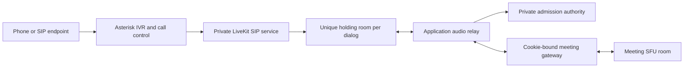

# Phone admission and isolated audio relay

Status: experimental, disabled by default. The application authority and `apps/phone` relay are implemented. The isolated validation fixture uses generated PCM and a simulated RTC caller; it does not prove an Asterisk IVR, native SIP trunk, carrier call, negotiated SIP TLS/SRTP, or telephone hangup. Do not publish a dial-in number from this milestone.

## Admission boundary

Each native SIP dialog must enter its own private, empty holding room. It must never dispatch directly to a Covemeet meeting. The application owns the 12-digit locator, separate 8-digit PIN, host lobby, lock/ban/permission decisions, and capacity reservation. A trusted relay connects the holding caller to the meeting only through the normal cookie-bound signaling gateway.



A stale SIP dispatch can recreate only an empty holding room. The relay's main-room token is short-lived, tied to the application participant session and current media policy, and accepted only with its matching cookie. It receives no browser host capability. Native participant IDs and relay participant IDs are distinct and mapped by the trusted call supervisor.

LiveKit documents `MoveParticipant` and `ForwardParticipant` as Cloud-only. The self-hosted implementation therefore does not use either as its admission boundary. [Participant management](https://docs.livekit.io/intro/basics/rooms-participants-tracks/participants/#move-participant)

Dispatch configuration must be pinned and tested with the chosen SIP release. Callee dispatch derives a room from the SIP destination and its prefix; reusing a destination can reuse a room. A prefix alone is not isolation. Allocate an unpredictable dialog-specific destination, authenticate the PBX trunk, prevent a second native participant from entering that room before any audio is returned, and verify the actual returned room name. The present relay requires `phone-hold-` followed by 16–128 alphanumeric/hyphen characters; native callee prefix formatting may require a coordinated validator change. Never introduce a shared catch-all meeting route. [Dispatch rules](https://docs.livekit.io/telephony/accepting-calls/dispatch-rule/)

## Implemented relay behavior

- `HttpAuthority` calls only the fixed private API paths. Requests use `Bearer PHONE_GATEWAY_KEY` and `X-Requested-With: CovemeetPhone`, with no browser Origin. Endpoint validation requires verified TLS in production; redirects are rejected and responses are capped at 65 KiB while streaming.
- Join returns a meeting code, participant ID, opaque session, and expiry. Polling every two seconds renews a lease of at most ten seconds. Lease expiry or an authority failure synchronously gates audio and begins teardown, even if an authority request is stalled.
- Waiting callers have no meeting media grant. Admission supplies the cookie-bound token, gateway origin, and explicit peer IDs whose microphone or shared-audio tracks may be received. Video, data, unrelated identities, and the relay's own output are not subscribed or forwarded.
- Caller-to-meeting audio is published only when admitted, self-unmuted, and allowed by the host. Phone callers start muted. Host permission or media-generation changes clear queued PCM and replace the meeting leg. Expected removal of that leg for a policy change leaves the isolated caller connected while a fresh poll authorizes the replacement.
- Audio is decoded/mixed using `@livekit/rtc-node` 1.1.0 `AudioMixer`: 48 kHz mono, 20 ms frames, bounded queues. Silent frames maintain the private return stream while waiting. This adds codec work and latency; capacity has not been benchmarked.
- The SDK cannot attach the application cookie directly. A per-call, loopback-only gateway adapter inserts that fixed cookie and Origin. It forwards SDK-refreshed tokens to the real gateway for validation and updates authority-issued token renewal without reconnecting on every poll. It cannot mint tokens or turn an arbitrary supplied token into a valid one.
- `*6` toggles self-mute and `*9` toggles hand raise. A blocked caller cannot regain speaking permission. Commands are accepted only from the known native participant. No PIN digits are broadcast into the meeting. `*0`, spoken help, and audible admission/recording notices are not implemented.
- Terminal close waits for in-flight gateway opening, RTC connection and track publication before acknowledging cleanup. Failed legs remain reachable for cleanup retry. Both SDK rooms must close and the scoped native participant must be removed before sending private `leave`, which releases the capacity reservation. An uncertain teardown retains the reservation.

The official SIP DTMF feature transports keypad events; the relay still requires an IVR to collect and validate entry credentials before a meeting grant exists. [DTMF handling](https://docs.livekit.io/telephony/features/dtmf/)

## Runtime contract

`npm run build -w apps/phone` builds the service; `npm start -w apps/phone` runs one supervised call. It exits without starting a relay unless `PHONE_ENABLED=true`.

Required environment:

| Setting                                 | Purpose                                                                          |
| --------------------------------------- | -------------------------------------------------------------------------------- |
| `PHONE_CALL_FILE`                       | Ephemeral JSON call input on a private tmpfs; format below.                      |
| `PHONE_AUTHORITY_URL`                   | Private API origin; no public route, arbitrary path, redirect or browser access. |
| `PHONE_GATEWAY_KEY`                     | Separate service credential shared only with the private authority.              |
| `SITE_ORIGIN`                           | Meeting application's origin; pins the media grant destination.                  |
| `LIVEKIT_URL`                           | Private RoomService endpoint used for scoped native participant removal.         |
| `LIVEKIT_API_KEY`, `LIVEKIT_API_SECRET` | Private media service credentials; never expose to callers.                      |
| `NODE_ENV`                              | `production` requires TLS for every configured service endpoint.                 |

Call-file shape (values below are placeholders, not a usable call):

```json
{
  "join": {
    "locator": "12 numeric digits",
    "pin": "8 numeric digits",
    "callId": "UUID bound to the real dialog",
    "trunkId": "authenticated-trunk-id"
  },
  "holding": {
    "url": "wss://private-sfu.example",
    "token": "holding-room-only relay token",
    "roomName": "phone-hold-unique-dialog-identifier",
    "participantIdentity": "exact-native-caller-identity"
  }
}
```

The caller ID is optional E.164 input and is not proof of identity. The supervisor must obtain it from an authenticated call path, treat it as untrusted, and keep it out of routine logs/media metadata. It must also bind the call UUID and holding-room identity to the same live dialog; they must not be supplied by an arbitrary client.

The file reader refuses symlinks, nonregular files, another user's files, group/other permissions and content over 32 KiB. It reads through the same opened file descriptor. The supervisor must create the file privately (0600), preferably on tmpfs, and delete it after the call is consumed. The CLI does not delete the caller-owned input. PIN/caller fields are cleared from retained JavaScript objects after joining, but JavaScript cannot guarantee secure memory erasure. Do not put raw PINs, tokens, cookies, call input or caller IDs in command arguments, images, committed configuration, telemetry or crash reports.

`terminateNative` currently removes and verifies absence of only the specified participant in the specified holding room. That is not proof that an original carrier/Asterisk leg has hung up. A future supervisor must close and confirm both external and internal call legs, reconcile orphan dialogs, and enforce wall-clock call limits even after a relay crash. A hung native SDK operation deliberately prevents cleanup acknowledgement rather than freeing a possibly active reservation.

## Local validation

Run `npm test -w apps/phone` for authority, relay, loopback proxy, subscription eligibility and deferred RTC lifecycle tests. These open no sound device. The loopback gateway test may need permission to bind its isolated ephemeral listener.

The separate `scripts/phone-test.mjs` / `infra/compose.phone-test.yaml` fixture owns a disposable PostgreSQL and SFU network with no host-published ports. Its runner uses the real API, database and relay with generated PCM, counting decoded samples in programmatic sinks. No physical microphone, speaker, browser playback, carrier or billable call is involved. Consult the generated report and the requirements ledger for the exact passing checks; fixture success is not native SIP interoperability or scale evidence.

## Gates before real dial-in

1. Implement the Asterisk ARI adapter: collect numeric credentials privately, bind a per-dialog holding destination and native identity, present a waiting notice, invoke admission, deliver keypad controls, and confirm both call legs terminate on kick/end/expiry/error. Protect ARI with network isolation and service authentication. Disable direct-media bypass when application-controlled mixing/events are required. [ARI DTMF](https://docs.asterisk.org/Configuration/Interfaces/Asterisk-REST-Interface-ARI/Introduction-to-ARI-and-Channels/ARI-and-Channels-Handling-DTMF/), [ARI bridges](https://docs.asterisk.org/Configuration/Interfaces/Asterisk-REST-Interface-ARI/Introduction-to-ARI-and-Bridges/ARI-and-Bridges-Basic-Mixing-Bridges/), [ARI channel operations](https://docs.asterisk.org/Asterisk_22_Documentation/API_Documentation/Asterisk_REST_Interface/Channels_REST_API/)
2. Pin LiveKit SIP and PBX images/configuration. Require verified SIP-over-TLS and mandatory SRTP on every SIP leg under our control; reject certificate failures, clear RTP and downgrade attempts. Test with a local SIP client using a null sound device before adding a carrier. The WebRTC relay's DTLS/SRTP does not prove SIP trunk encryption. [Self-hosted SIP](https://docs.livekit.io/transport/self-hosting/sip-server/), [secure trunking](https://docs.livekit.io/telephony/features/secure-trunking/), [Asterisk PJSIP options](https://docs.asterisk.org/Asterisk_22_Documentation/API_Documentation/Module_Configuration/res_pjsip/)
3. Prove native reconnect/redial cannot receive shared-room audio without new authorization, including concurrent calls to the same destination and termination races. Do not rely on a webhook removing an unauthorized caller after audio delivery.
4. Verify the chosen upstream SIP build never logs sensitive entered PINs. The reviewed upstream `inbound.go` PIN branch logs the entered value; this design collects PINs in the application IVR instead of that native dispatch path. Recheck source and logs when pinning the release. [Upstream SIP inbound source](https://github.com/livekit/sip/blob/main/pkg/sip/inbound.go)
5. Implement carrier limits: no arbitrary outbound or premium-number routing, per-trunk/caller attempt limits, maximum lobby/call duration, hard concurrency/spend stops, and crash reconciliation. Test rejected/unreachable/duplicate native hangup responses and loss of the authority/PBX/SFU.
6. Keep recording unavailable while phone participation is active until audible notices, consent and stop behavior are implemented and tested. Phone breakout moves remain unsupported. Test webinar listen-only behavior and promotion separately.
7. Measure codec compatibility, packet loss, DTMF reliability, double talk/echo, added latency, reconnect and simultaneous-call load. Recordings, relay decode/mix and native SIP increase resource usage and cannot inherit the browser capacity estimate.

Ordinary PSTN is outside the encrypted SIP/WebRTC boundary. The relay operator can process audio. This milestone does not establish end-to-end encryption, compliance, certification, production readiness, or a guaranteed hosting cost.
