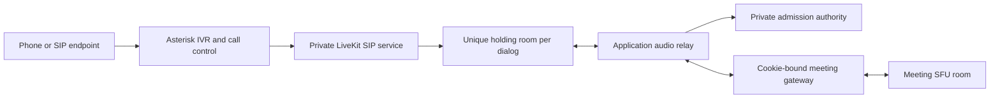

# Phone admission and isolated audio relay

Status: experimental, disabled by default. The application authority, audio relay, private Asterisk ARI supervisor and native SIP holding adapter are implemented. `scripts/phone-test.mjs` checks the RTC relay; `scripts/sip-test.mjs` separately exercises a native SIP client. Consult each generated report for its actual passing scope. There is no carrier integration or production service launcher yet. Do not publish a dial-in number from this milestone.

## Admission boundary

Each native SIP dialog must enter its own private, empty holding room. It must never dispatch directly to a Covemeet meeting. The application owns the 12-digit locator, separate 8-digit PIN, host lobby, lock/ban/permission decisions, and capacity reservation. A trusted relay connects the holding caller to the meeting only through the normal cookie-bound signaling gateway.



A stale SIP dispatch can recreate only an empty holding room. The relay's main-room token is short-lived, tied to the application participant session and current media policy, and accepted only with its matching cookie. It receives no browser host capability. Native participant IDs and relay participant IDs are distinct and mapped by the trusted call supervisor.

LiveKit documents `MoveParticipant` and `ForwardParticipant` as Cloud-only. The self-hosted implementation therefore does not use either as its admission boundary. [Participant management](https://docs.livekit.io/intro/basics/rooms-participants-tracks/participants/#move-participant)

The pinned LiveKit SIP 1.17.0 callee dispatch uses `randomize: true`, an empty prefix and a supervisor-generated `phone-hold-<UUID>` destination. Its room has an additional randomized suffix and a two-participant limit. The adapter requires exactly one matching room and one native SIP participant bound to the configured trunk/rule before bridging. The PBX uses the fixed opaque From user `covemeet-pbx`; `hidePhoneNumber` maps this to a fixed hashed identity, never the original caller ID. Native SIP digest authentication and the exact private PBX address restrict trunk entry. Never introduce a shared catch-all meeting route. [Dispatch rules](https://docs.livekit.io/telephony/accepting-calls/dispatch-rule/)

## Implemented relay behavior

- `HttpAuthority` calls only the fixed private API paths. Requests use `Bearer PHONE_GATEWAY_KEY` and `X-Requested-With: CovemeetPhone`, with no browser Origin. Endpoint validation requires verified TLS in production; redirects are rejected and responses are capped at 65 KiB while streaming.
- Join returns a meeting code, participant ID, opaque session, and expiry. Polling every two seconds renews a lease of at most ten seconds. Lease expiry or an authority failure synchronously gates audio and begins teardown, even if an authority request is stalled.
- Waiting callers have no meeting media grant. Admission supplies the cookie-bound token, gateway origin, and explicit peer IDs whose microphone or shared-audio tracks may be received. Video, data, unrelated identities, and the relay's own output are not subscribed or forwarded.
- Caller-to-meeting audio is published only when admitted, self-unmuted, and allowed by the host. Phone callers start muted. Host permission or media-generation changes clear queued PCM and replace the meeting leg. Expected removal of that leg for a policy change leaves the isolated caller connected while a fresh poll authorizes the replacement.
- Audio is decoded/mixed using `@livekit/rtc-node` 1.1.0 `AudioMixer`: 48 kHz mono, 20 ms frames, bounded queues. Silent frames maintain the private return stream while waiting. This adds codec work and latency; capacity has not been benchmarked.
- The SDK cannot attach the application cookie directly. A per-call, loopback-only gateway adapter inserts that fixed cookie and Origin. It forwards SDK-refreshed tokens to the real gateway for validation and updates authority-issued token renewal without reconnecting on every poll. It cannot mint tokens or turn an arbitrary supplied token into a valid one.
- `*6` toggles self-mute and `*9` toggles hand raise. A blocked caller cannot regain speaking permission. The standalone RTC relay accepts commands only from the known native participant. With Asterisk, only the original ARI caller channel controls keypad actions; forwarded native DTMF is ignored to prevent double toggles. The supervisor implements `*0` help, waiting/admission and mute/block announcements. Numeric credentials are collected before any native bridge exists. Recording notices/consent are not implemented; recording remains incompatible with active phone participation.
- Terminal close waits for in-flight gateway opening, RTC connection and track publication before acknowledging cleanup. Failed legs remain reachable for cleanup retry. Both SDK rooms must close and the scoped native participant must be removed before sending private `leave`, which releases the capacity reservation. An uncertain teardown retains the reservation.

The official SIP DTMF feature transports keypad events; the relay still requires an IVR to collect and validate entry credentials before a meeting grant exists. [DTMF handling](https://docs.livekit.io/telephony/features/dtmf/)

## Runtime contract

`npm run build -w apps/phone` builds the service; `npm start -w apps/phone` runs one supervised call. It exits without starting a relay unless `PHONE_ENABLED=true`.

Required environment:

| Setting                                 | Purpose                                                                          |
| --------------------------------------- | -------------------------------------------------------------------------------- |
| `PHONE_CALL_FILE`                       | Ephemeral JSON call input on a private tmpfs; format below.                      |
| `PHONE_AUTHORITY_URL`                   | Private API origin; no public route, arbitrary path, redirect or browser access. |
| `PHONE_GATEWAY_KEY`                     | Separate service credential shared only with the private authority.              |
| `SITE_ORIGIN`                           | Meeting application's origin; pins the media grant destination.                  |
| `LIVEKIT_URL`                           | Private RoomService endpoint used for scoped native participant removal.         |
| `LIVEKIT_API_KEY`, `LIVEKIT_API_SECRET` | Private media service credentials; never expose to callers.                      |
| `NODE_ENV`                              | `production` requires TLS for every configured service endpoint.                 |

Call-file shape (values below are placeholders, not a usable call):

```json
{
  "join": {
    "locator": "12 numeric digits",
    "pin": "8 numeric digits",
    "callId": "UUID bound to the real dialog",
    "trunkId": "authenticated-trunk-id"
  },
  "holding": {
    "url": "wss://private-sfu.example",
    "token": "holding-room-only relay token",
    "roomName": "phone-hold-unique-dialog-identifier",
    "participantIdentity": "exact-native-caller-identity"
  }
}
```

The caller ID is optional E.164 input and is not proof of identity. The supervisor must obtain it from an authenticated call path, treat it as untrusted, and keep it out of routine logs/media metadata. It must also bind the call UUID and holding-room identity to the same live dialog; they must not be supplied by an arbitrary client.

The file reader refuses symlinks, nonregular files, another user's files, group/other permissions and content over 32 KiB. It reads through the same opened file descriptor. The supervisor must create the file privately (0600), preferably on tmpfs, and delete it after the call is consumed. The CLI does not delete the caller-owned input. PIN/caller fields are cleared from retained JavaScript objects after joining, but JavaScript cannot guarantee secure memory erasure. Do not put raw PINs, tokens, cookies, call input or caller IDs in command arguments, images, committed configuration, telemetry or crash reports.

The standalone call-file CLI removes only its scoped native participant. The new `SipSupervisor` + `SipHolding` composition also owns both Asterisk channels and the mixing bridge: it checks their termination and removes the exact native participant before releasing capacity. Unknown mutation/cleanup outcomes retain the reservation and local slot. Durable orphan reconciliation after supervisor/process loss remains unimplemented. A hung native SDK operation deliberately prevents cleanup acknowledgement rather than freeing a possibly active reservation.

## Native supervisor and fixture

`AriClient` uses a fixed private management origin, header-only authentication, bounded messages/responses, heartbeat and terminal failure handling. Production mode requires HTTPS/WSS with certificate validation. Each inbound call must use the expected PJSIP endpoint, context and extension. After answering, both `CHANNEL(pjsip,secure)` and `CHANNEL(rtp,secure)` must report encryption before numeric credentials are collected. The outbound leg receives the same checks. [Asterisk channel fields](https://docs.asterisk.org/Asterisk_22_Documentation/API_Documentation/Dialplan_Functions/CHANNEL/)

Code/PIN entry is bounded to 12/8 digits, 60 seconds and a 32-event queue. The PBX bridge explicitly requests `mixing,proxy_media,dtmf_events`, so Asterisk stays on the media/event path. Mandatory waiting/admission notices finish before meeting media opens; cancellation waits for an in-flight announcement creation before deleting it. The native service first subscribes to a silent return track in its isolated holding room while ringing; only an answered, encryption-verified leg is bridged to the original caller. Terminal closure waits for late setup and both media legs. The local cap is at most 20 calls, including unresolved teardown. [ARI mixing behavior](https://docs.asterisk.org/Configuration/Interfaces/Asterisk-REST-Interface-ARI/Introduction-to-ARI-and-Bridges/ARI-and-Bridges-Basic-Mixing-Bridges/)

`npm run test:sip` builds pinned Asterisk 22.11.0, LiveKit SIP 1.17.0 and a PJSIP 2.17 client with physical sound/video backends disabled. A disposable internal Docker network contains PostgreSQL, Redis, SFU, PBX, native SIP and the test runner. It has no host-published ports. The test creates its own short-lived CA and never installs it into a trust store. Generated credentials and volumes are removed afterward. Do not reuse this development fixture for deployment: its isolated ARI/SFU control uses HTTP/WS, Redis has no production access policy, and it has no carrier route.

Both SIP legs require verified TLS and [SDES-SRTP (RFC 4568)](https://www.rfc-editor.org/rfc/rfc4568); the client asserts the negotiated suite. Native SIP cannot disable its built-in plaintext listener in this pinned version, so its container blocks TCP/UDP 5060 before startup and then drops all Linux capabilities. The PBX exposes only TLS. The existing WebRTC leg separately uses DTLS-SRTP. These are encrypted hops with trusted media processors, not end-to-end encryption through the PBX.

The harness stores only counters, state and verification results in ignored `test-results/sip/sip-media.json`. Native client stderr is discarded, PBX DTMF/debug logging is disabled and native SIP dispatch has no PIN handler. Its upstream PIN handler can log entered digits; that path must remain unused.

## Local validation

Run `npm test -w apps/phone` for authority, relay, loopback proxy, subscription eligibility and deferred RTC lifecycle tests. These open no sound device. The loopback gateway test may need permission to bind its isolated ephemeral listener.

The separate `scripts/phone-test.mjs` / `infra/compose.phone-test.yaml` fixture owns a disposable PostgreSQL and SFU network with no host-published ports. Its runner uses the real API, database and relay with generated PCM, counting decoded samples in programmatic sinks. No physical microphone, speaker, browser playback, carrier or billable call is involved. Consult the generated report and the requirements ledger for the exact passing checks; fixture success is not native SIP interoperability or scale evidence.

## Gates before real dial-in

1. Deploy and validate the implemented ARI adapter with authenticated private HTTPS/WSS, independent process supervision, durable orphan reconciliation and carrier-side time/concurrency limits. Verify both call legs terminate under actual restart, network partition and ambiguous provider outcomes. [ARI DTMF](https://docs.asterisk.org/Configuration/Interfaces/Asterisk-REST-Interface-ARI/Introduction-to-ARI-and-Channels/ARI-and-Channels-Handling-DTMF/), [ARI bridges](https://docs.asterisk.org/Configuration/Interfaces/Asterisk-REST-Interface-ARI/Introduction-to-ARI-and-Bridges/ARI-and-Bridges-Basic-Mixing-Bridges/), [ARI channel operations](https://docs.asterisk.org/Asterisk_22_Documentation/API_Documentation/Asterisk_REST_Interface/Channels_REST_API/)
2. Maintain the pinned SIP/PBX sources and verify production certificate rotation, outbound certificate failure, SRTP policy and every network boundary on the target OS. Run the local native fixture before adding a carrier. The WebRTC relay's DTLS/SRTP does not prove SIP trunk encryption. [Self-hosted SIP](https://docs.livekit.io/transport/self-hosting/sip-server/), [secure trunking](https://docs.livekit.io/telephony/features/secure-trunking/), [Asterisk PJSIP options](https://docs.asterisk.org/Asterisk_22_Documentation/API_Documentation/Module_Configuration/res_pjsip/)
3. Prove native reconnect/redial cannot receive shared-room audio without new authorization, including concurrent calls to the same destination and termination races. Do not rely on a webhook removing an unauthorized caller after audio delivery.
4. Verify the chosen upstream SIP build never logs sensitive entered PINs. The reviewed upstream `inbound.go` PIN branch logs the entered value; this design collects PINs in the application IVR instead of that native dispatch path. Recheck source and logs when pinning the release. [Upstream SIP inbound source](https://github.com/livekit/sip/blob/main/pkg/sip/inbound.go)
5. Implement carrier limits: no arbitrary outbound or premium-number routing, per-trunk/caller attempt limits, maximum lobby/call duration, hard concurrency/spend stops, and crash reconciliation. Test rejected/unreachable/duplicate native hangup responses and loss of the authority/PBX/SFU.
6. Keep recording unavailable while phone participation is active until audible notices, consent and stop behavior are implemented and tested. Phone breakout moves remain unsupported. Test webinar listen-only behavior and promotion separately.
7. Measure codec compatibility, packet loss, DTMF reliability, double talk/echo, added latency, reconnect and simultaneous-call load. Recordings, relay decode/mix and native SIP increase resource usage and cannot inherit the browser capacity estimate.

Ordinary PSTN is outside the encrypted SIP/WebRTC boundary. The relay operator can process audio. This milestone does not establish end-to-end encryption, compliance, certification, production readiness, or a guaranteed hosting cost.
